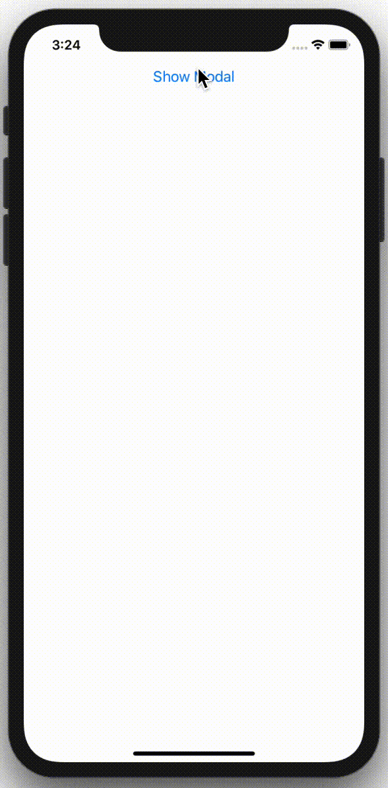
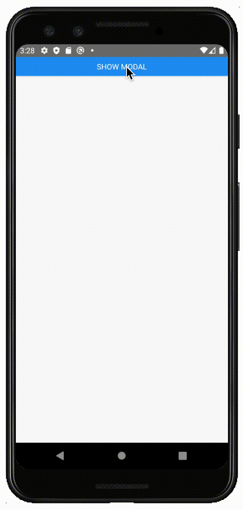

# React Native Contact Action Sheet

[](https://badge.fury.io/js/react-native-contact-action-sheet)
[](https://www.npmjs.com/package/react-native-contact-action-sheet)

*  [Features](#features)
*  [Built With](#built-with)
*  [Pending Items](#pending-items)
*  [Screenshot (iOS)](#screenshot-ios)
*  [Screenshot (Android)](#screenshot-android)
*  [Getting Started](#getting-started)
*  [Props](#props)
*  [Building & Publishing](#building-&-publishing)
*  [Changelog](#changelog)


## Features
*  ✅ iOS/Android
*  ✅ Dark Mode
*  ✅ Built with TypeScript
*  ✅ Built with React Hooks


## Built With
* [TypeScript](https://github.com/microsoft/TypeScript) - Programming Language
* [React Hooks](https://reactjs.org/docs/hooks-intro.html) - Functional Component State/Lifecycle Methods
* [React Native](https://facebook.github.io/react-native/) - Mobile (iOS/Android) Framework
* [React Native Modal](https://github.com/react-native-community/react-native-modal) - Modal
* [React Native Vector Icons](https://www.npmjs.com/package/react-native-vector-icons) - Icons


## Pending Items
- [ ] 


## Screenshot (iOS)
<div align="center">
  
</div>

## Screenshot (Android)
<div align="center">
  
</div>


## Getting Started
**Note:** Maximum of 6 Phone Numbers and/or Emails allowed.

**1. Install Package:**
```
npm i react-native-contact-action-sheet
```

**2. Install additional dependencies:**

**Note:** This NPM Package uses the [Native Module](https://reactnative.dev/docs/native-modules-intro) [`react-native-vector-icons`](https://github.com/oblador/react-native-vector-icons), so it must be installed in your project.

```
npm i react-native-vector-icons
```

**3. Install Cocoapods:**
```
cd ios

pod install
```

**4. Add Example Code:**
```typescript
// Imports: Dependencies
import React, { useState } from 'react';
import { Button, SafeAreaView } from 'react-native';
import { ContactActionSheet, ContactItem }  from 'react-native-contact-action-sheet';

// App
const App: React.FC = (): JSX.Element => {
  // React Hooks: State
  const [ visible, setVisible ] = useState<boolean>(false);

  // Contacts
  const contacts: Array<ContactItem> = [
    {
      title: 'Company Headquarters',
      type: 'Phone Number',
      contact: '(555) 555-5555',
    },
    {
      title: 'Retail Store',
      type: 'Phone Number',
      contact: '(777) 777-7777',
    },
    {
      title: 'Retail Store',
      type: 'Message',
      contact: '(777) 777-7777',
    },
    {
      title: 'Retail Store',
      type: 'Email',
      contact: 'hq@company.com',
    },
    {
      title: 'Website',
      type: 'Website',
      contact: 'https://company.com',
    },
  ];

  return (
    <SafeAreaView>
      <Button
        title="Show Modal"
        onPress={() => setVisible(!visible)}
      />

      <ContactActionSheet
        toggle={() => setVisible(!visible)}
        contactsList={contacts}
        modalVisible={visible}
        darkMode={false}
      />
    </SafeAreaView>
  );
};

// Exports
export default App;
```

**4. Run Project:**

**Android**
```javascript
react-native run-android
```

**iOS**
```javascript
react-native run-ios
```


## Props

**Default:**
| Property          |   Type                 |  Default              | Description                                                            |
| ----------------- | :--------------------: | :-------------------: | ---------------------------------------------------------------------- |
| `toggle`          | `() => void`           | `undefined`           | Toggle modal (Show/Hide)                                               |
| `modalVisible`    | `boolean`              | `false`               | Modal visible                                                          |
| `contactsList`    | `Array<ContactItem>`   | `[]`                  | Contact data (Phone number, Email Address, Website)                    |


**Optional:**
| Property                          |   Type                       |  Default     | Description                                                            |
| --------------------------------- | :--------------------------: | :----------: | ---------------------------------------------------------------------- |
| `darkMode`                        | `boolean`                    | `false`      | Dark mode                                                              |


## Building & Publishing

**Build**
```javascript
npm run build
```

**Publish**
```javascript
npm publish
```

## Changelog

### [1.0.0] - 5/24/2021

***Added***

- Added `LICENSE`.

### [0.1.28] - 5/24/2021

***Added***

- Added styling to `ContactActionSheet`.

### [0.1.27] - 5/24/2021

***Added***

- Added `react-native-vector-icons` from `peerDependency`.

***Removed***

- Fixed `<View>` issue.

### [0.1.26] - 5/24/2021

***Removed***

- Removed `react-native-vector-icons` from `peerDependency`.

### [0.1.25] - 5/24/2021

***Changed***

- Changed `react-native-vector-icons` from `dependency` to `devDependency` and `peerDependency`.
- Updated Getting Started in `README`.
- Fixed missing `react` `peerDependency`.
- Fixed missing `react-native` `peerDependency`.

***Removed***

- Removed `RNVectorIcons.podspec` from `src`.

### [0.1.24] - 5/24/2021

- Updated example code in `README`.

### [0.1.23] - 5/24/2021

***Added***

- Added `RNVectorIcons.podspec` to `src`.

### [0.1.22] - 5/24/2021

***Changed***

- Updated example code in `README`.
- Changed main path from `dist/index.js` to `./dist/index.js`in `package.json`.
- Changed types path from `dist/index.d.ts` to `./dist/index.d.ts` in `package.json`.

***Removed***

- Removed `react-native-typescript-transformer` as dependency.

### [0.1.20] - 5/22/2021

***Changed***

- Fixed `npm run build` and `npm publish` issue.

### [0.1.19] - 5/22/2021

***Changed***

- Changing `import Icon from 'react-native-vector-icons/Ionicons'` to `import Ionicons from 'react-native-vector-icons/Ionicons'`.

### [0.1.18] - 5/22/2021

***Changed***

- Updating Getting Started in `README`.

### [0.1.17] - 5/20/2021

***Changed***

- Updating Getting Started in `README`.

### [0.1.16] - 5/20/2021

***Changed***

- Changed `react-native-iphone-x-helper`, `react-native-modal`, and `react-native-vector-icons` from `peerDependencies` to `dependencies`.

### [0.1.15] - 5/20/2021

***Added***

- Added Props section to `README`.
- Added Example App section to `README`.

***Changed***

- Changed file structure.
- Changed `index.js` to `index.tsx`.
- Changed `package.json` build script to `cd src && tsc && cp ../package.json && Echo Build completed!`.

***Removed***

- Removed `dependencies`.

### [0.1.14] - 5/17/2021

***Changed***

- Updated`dependencies` in `package.json`.
- Changed`visible` to `modalVisible`.

***Removed***

- Removed `react-native-vector-icons` in `index.js`.
- Removed `react-native-vector-icons` as a dependency.

### [0.1.10] - 5/17/2021

***Changed***

- Importing `react-native-vector-icons` in `index.js`.

### [0.1.9] - 5/17/2021

***Changed***

- Adding `react-native-vector-icons` as a dependency.

### [0.1.8] - 5/16/2021

***Changed***

- Exported `ContactItem` TypeScript Type.
- Updated example code.

### [0.1.7] - 5/16/2021

***Changed***

- Fixed `package.json` missing `files` issue.

### [0.1.6] - 5/16/2021

***Changed***

- Fixed missing `README` issue.

### [0.1.5] - 5/16/2021

***Added***

- Added `darkMode` prop.

***Changed***

- Changed `react-native-iphone-x-helper` to `peerDependency`.
- Changed `react-native-modal` to `peerDependency`.
- Changed `react-native-vector-icons` to `peerDependency`.
- Updated `README` Getting Started for `iOS` pods.
- Updated `README` Getting Started for `Android` dependencies.

***Removed***

- Removed `Appearance` `react-native` prop for better dark mode support.

### [0.1.4] - 5/13/2021

***Added***

- Added TypeScript `types` folder.

### [0.1.3] - 8/9/2020

***Added***

- Added Dark Mode support. Please upgrade to `React Native 0.62` for this to work.

***Changed***

- Updated `react` dependency.
- Updated `react-native` dependency.
- Updated `react-native-vector-icons` dependency.
- Updated `react-native-modal` dependency.

***Removed***

- Removed `react-native-dark-mode` dependency (Deprecated).

### [0.1.2] - 4/2/2020

***Added***

- Added Website.

### [0.1.1] - 2/4/2020

***Added***

- Added `formatPhoneNumber` to convert phone number to `15555555555` format.

***Changed***

- Fixed `react-native-vector-icons` link issue.

### [0.1.0] - 2/3/2020

***Changed***

- Fixed `react-native-vector-icons` `podfile` issue.

### [0.0.6] - 1/31/2020

***Changed***

- Fixed maximum contacts issue.
- Fixed `outDir/dist` issue.

### [0.0.5] - 1/31/2020

***Changed***

- Fixed `README` example code.

### [0.0.3] - 1/31/2020

***Added***

- Added support for Message.

***Changed***

- Fixed `toggle` issue.

### [0.0.2] - 1/30/2020

***Added***

- Added `Android` Support.
- Added iPhone X/11 Support.
- Added screenshots.

***Changed***

- Styling changes.
